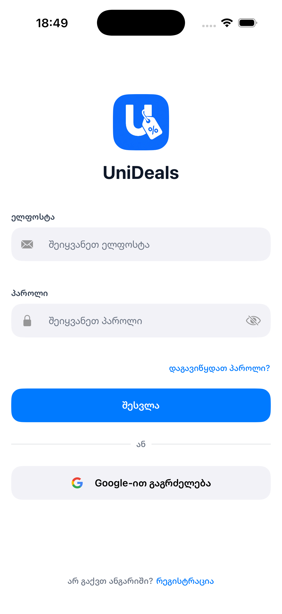
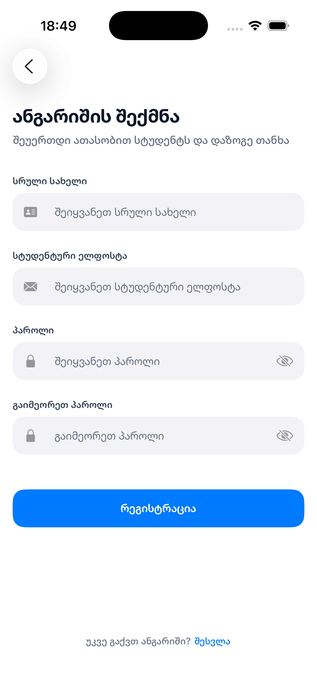
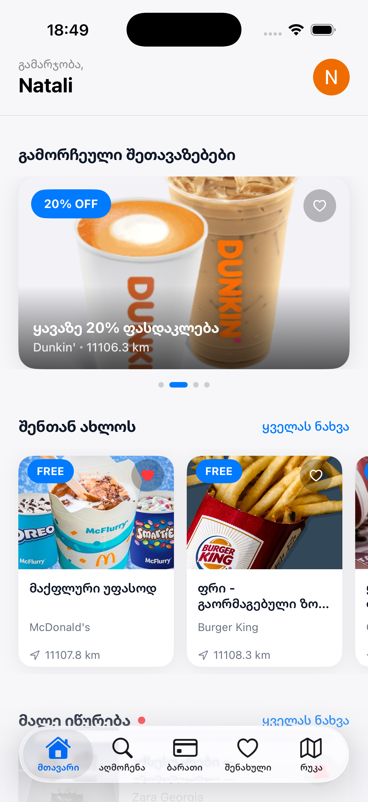
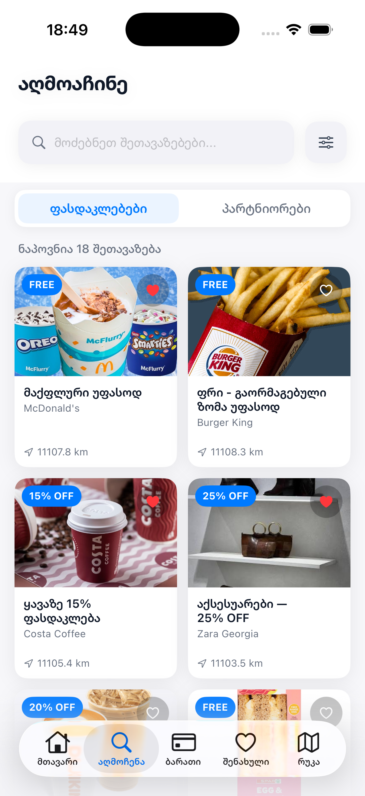
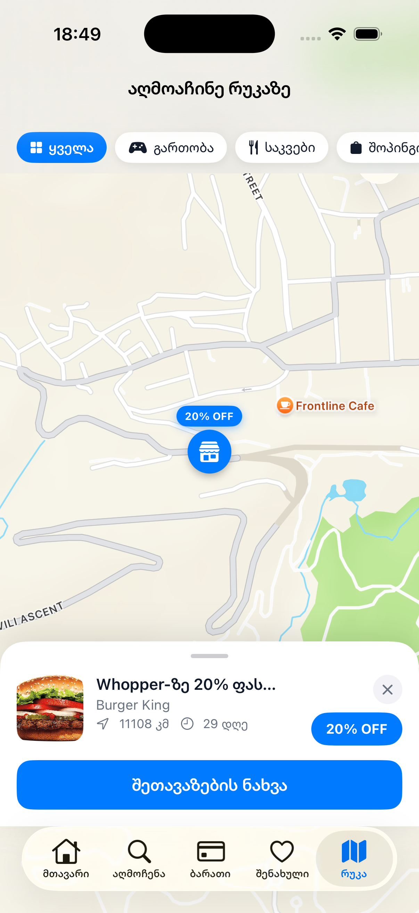
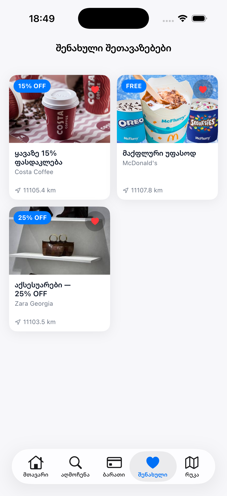
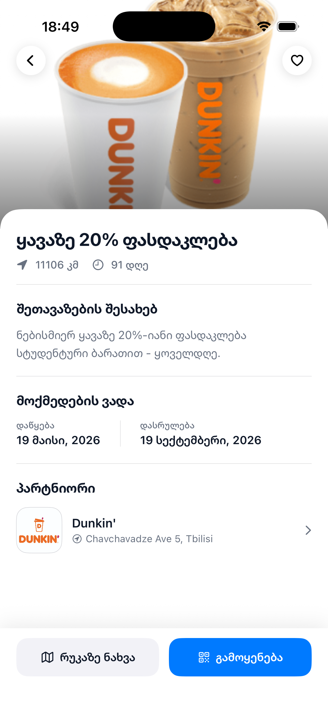
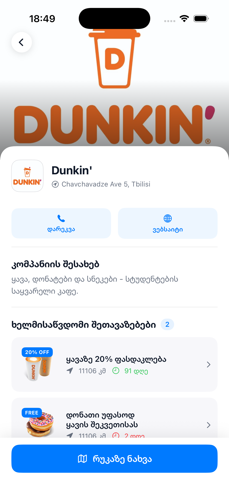
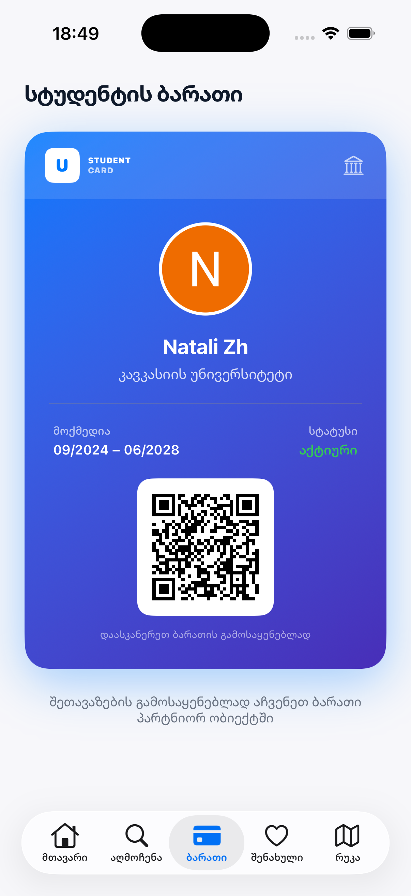

# UniDeals

An iOS app that connects Georgian university students with exclusive discounts from local businesses. Students get a digital student card with a QR code and use it to claim deals at partner stores.

---

## Screenshots

| Sign In | Sign Up | Forgot Password |
|---------|---------|----------------|
|  |  |  |

| Home | Explore | Map | Saved | Offer Details | Partner Details | Student Card |
|------|---------|-----|-------|--------------|----------------|--------------|
|  |  |  |  |  |  |  |

---

## Features

- **Authentication** — Email/password and Google Sign-In via Firebase Auth
- **Onboarding** — University and graduation year selection on first launch
- **Home Feed** — Featured deals, nearby offers sorted by distance, and expiring soon section
- **Explore** — Browse partners and discounts filtered by category
- **Offer Details** — Description, validity dates, distance, save button, and QR code redemption
- **Partner Details** — Partner profile, contact actions, and all available offers
- **Student Card** — Digital card with personal QR code used to claim discounts
- **Map** — All partner locations on an interactive MapKit map
- **Saved Discounts** — Bookmarked offers persisted per user in Firestore
- **Profile** — View and edit university info, sign out

---

## Tech Stack

| | |
|--|--|
| Language | Swift 5.9 |
| UI | SwiftUI + UIKit |
| Architecture | MVVM + Coordinator |
| Backend | Firebase Firestore |
| Auth | Firebase Auth + Google Sign-In |
| Images | Kingfisher |
| Maps | MapKit + CoreLocation |
| Min iOS | iOS 17 |

---

## Architecture

The app uses a hybrid **MVVM + Coordinator** pattern — UIKit handles navigation, SwiftUI handles all UI rendering.

- **Coordinators** own a `UINavigationController` and manage push/pop/modal flows. Each tab has its own coordinator (`HomeCoordinator`, `ExploreCoordinator`, `MapCoordinator`, `SavedDiscountsCoordinator`), all managed by `MainTabCoordinator`.
- **ViewModels** use `ObservableObject` and expose navigation as closures (`onBack`, `onDiscountTapped`, `onPartnerTapped`) that coordinators set before pushing a view. This keeps ViewModels free of UIKit.
- **SwiftUI Views** are wrapped in `UIHostingController` and receive their ViewModel via initializer.
- **Services** (`DiscountService`, `PartnerService`, `AuthService`, `SavedDiscountsService`) are singletons that handle all Firestore and Auth operations.

```
AppCoordinator
├── AuthCoordinator       → Login / Sign Up / Forgot Password (UIKit)
└── MainTabCoordinator
    ├── HomeCoordinator           → HomeView (SwiftUI)
    ├── ExploreCoordinator        → ExploreView (SwiftUI)
    ├── CardCoordinator           → CardView (SwiftUI)
    ├── MapCoordinator            → MapView (SwiftUI)
    └── SavedDiscountsCoordinator → SavedDiscountsView (SwiftUI)
```

---

## Installation & Setup

**Prerequisites**
- Xcode 15+
- iOS 17+
- A Firebase project with **Firestore** and **Authentication** (Email/Password + Google) enabled

**Steps**

1. Clone the repo
   ```bash
   git clone https://github.com/nnttl/CU-Bachelors-Project.git
   cd CU-Bachelors-Project
   ```

2. Open `CU-Bachelors-Project.xcodeproj` in Xcode

3. Add your `GoogleService-Info.plist` to the project target (download from Firebase Console → Project Settings)

4. Swift Package dependencies resolve automatically on first open. If not:
   `File → Packages → Resolve Package Versions`

5. Select a simulator or device running iOS 17+ and press `⌘R`

---

## Author

**Natali Zhgenti** — Caucasus University, 2026
